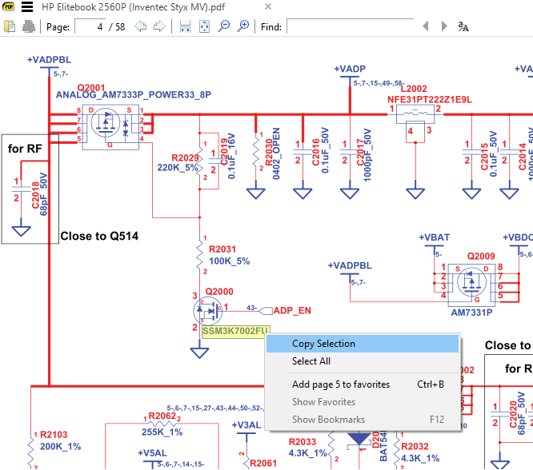
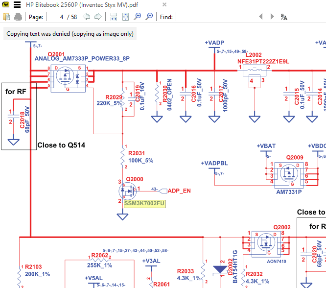
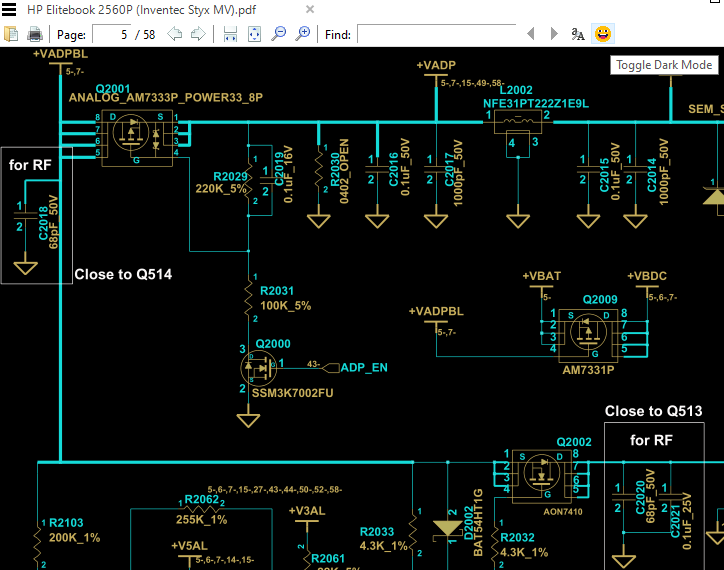

## Custom SumatraPDF Reader
The original software contains restrictions for copying or printing protected documents. This customised version has removed those restrictions and also includes a smiley face button on the toolbar which will toggle Dark Mode.

Restriction example:

Dark Mode example:

More information:

SumatraPDF is a multi-format (PDF, EPUB, MOBI, FB2, CHM, XPS, DjVu) reader
for Windows under (A)GPLv3 license, with some code under BSD license (see
AUTHORS).

* [main website](http://www.sumatrapdfreader.org) with downloads and documentation
* [manual](https://www.sumatrapdfreader.org/manual.html)
* [all other docs](https://www.sumatrapdfreader.org/docs/SumatraPDF-documentation-fed36a5624d443fe9f7be0e410ecd715.html)
